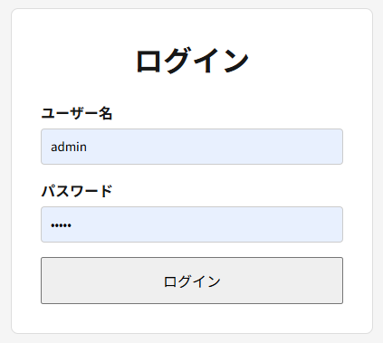
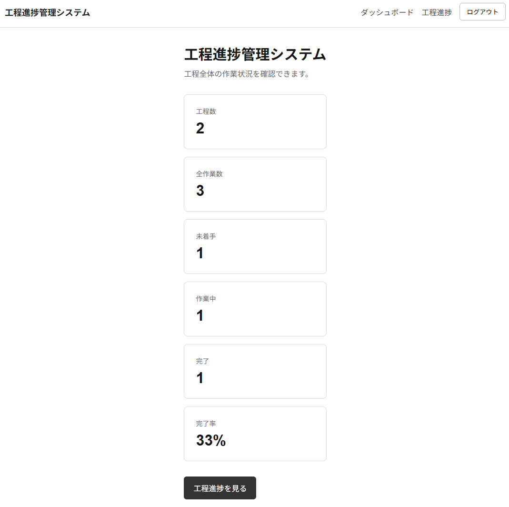
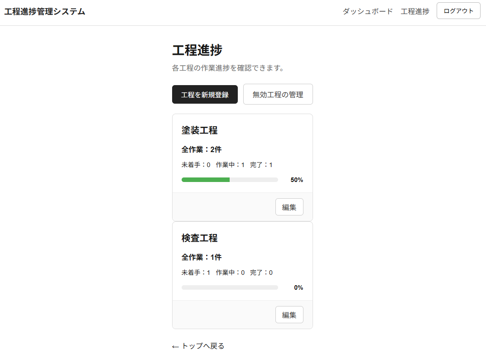
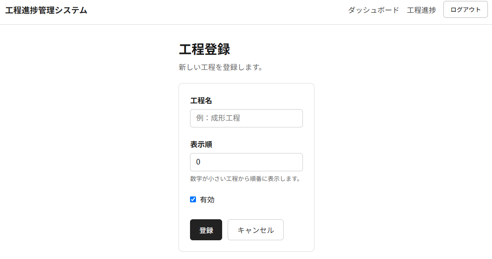
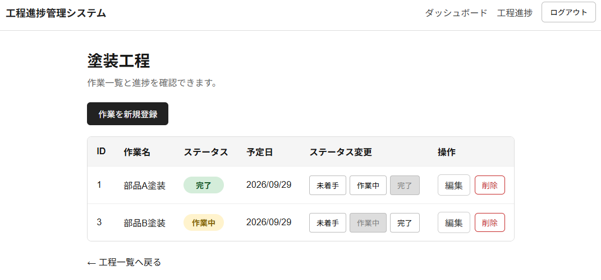
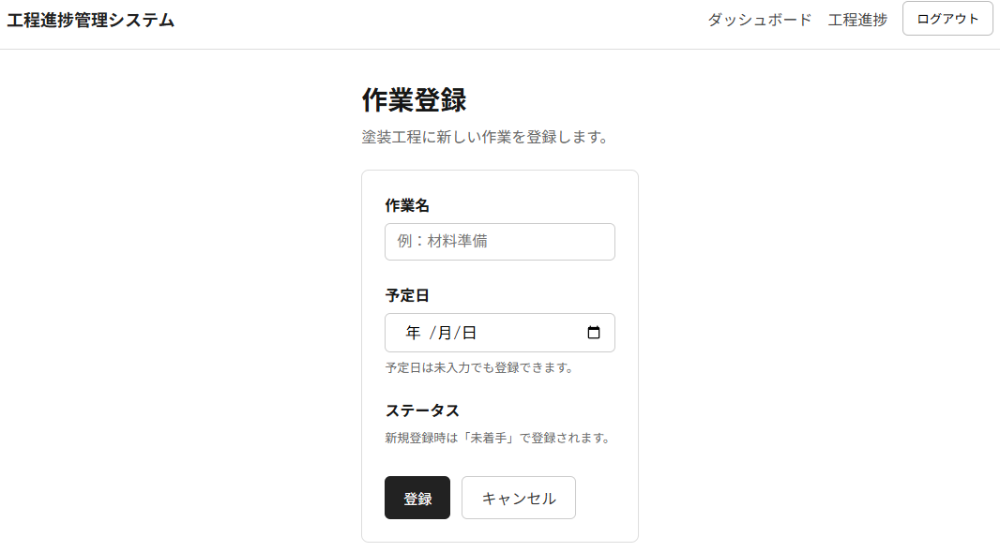

# 簡易工程進捗管理システム

ASP.NET Core Web API + Next.js + PostgreSQL を使用して作成した、工場向けの簡易工程進捗管理Webアプリケーションです。

作業・工程の管理を中心に、JWTによる認証・認可、SignalRによるリアルタイム更新、Dockerによるローカル環境構築、各種テスト、クラウド環境へのデプロイまで実装しています。

C#での開発経験をベースに、フロントエンド・バックエンド・DB・認証・リアルタイム通信・テスト・デプロイを含むWebアプリケーション全体の構成を段階的に実装しました。

---

## デモ

フロントエンドはVercel、APIはRender、DBはNeonへデプロイしています。

無料枠のクラウドサービスを利用しているため、初回アクセス時やAPI通信に時間がかかる場合があります。

- フロントエンド: https://production-progress-web.vercel.app

認証情報：

- ユーザー名：admin

- パスワード：admin

---

## 技術記事

今回開発したシステムの技術記事を下記URLに投稿しています。

Qiita: https://qiita.com/yusuke21301/items/66b439185f1a37829f02

---

## 概要

システム全体は次の構成です。

```text
ブラウザ
   ↓
Next.js + TypeScript / Vercel
   ↓ HTTP / JSON
ASP.NET Core Web API / Render
   ↓
Entity Framework Core
   ↓
PostgreSQL / Neon

ブラウザ
   ↕
SignalR
   ↕
ASP.NET Core / Render
```

フロントエンドとバックエンドを分離し、Next.jsからASP.NET Core Web APIを呼び出して作業・工程データを操作します。

作業データが登録・更新・削除された場合は、SignalRを利用して接続中の別ブラウザへ通知し、画面をリアルタイムに更新します。

---

## 画面イメージ

### ログイン画面



### トップページ



### 工程一覧画面



### 工程登録画面



### 作業一覧画面



### 作業登録画面



---

## 主な機能

- ログイン
- JWT認証
- `Admin` / `Worker` のRole認可
- 作業一覧表示
- 作業新規登録
- 作業更新
- 作業削除
- 工程一覧表示
- 工程登録・更新
- 使用停止中工程への作業登録制御
- SignalRによる作業変更通知
- 複数ブラウザ間でのリアルタイム更新
- SignalR自動再接続
- レスポンシブ対応
- Docker Composeによるローカル環境構築
- xUnit / Moqによる単体テスト
- WebApplicationFactoryによるAPI統合テスト
- TestcontainersによるPostgreSQL統合テスト
- PlaywrightによるE2Eテスト
- Vercel / Render / Neonへのデプロイ

---

## 使用技術

### フロントエンド

- Next.js 16
- React
- TypeScript
- App Router
- Server Components
- Client Components
- Server Actions
- SignalR JavaScript Client
- CSS
- Vercel

### バックエンド

- C#
- .NET 10
- ASP.NET Core Web API
- Entity Framework Core
- SignalR
- JWT Bearer Authentication
- Role Authorization
- Swagger / OpenAPI
- Render

### データベース

- PostgreSQL
- Neon
- EF Core Migration

### テスト

- xUnit
- Moq
- `WebApplicationFactory`
- Testcontainers for .NET
- Playwright

### 開発・実行環境

- Visual Studio
- Visual Studio Code
- Docker
- Docker Compose
- Git
- GitHub
- SourceTree
- npm

---

## 技術選定の方針

本プロジェクトでは、単に複数の技術を使用するのではなく、Webアプリケーションを構成する各要素の役割を分けて実装することを意識しました。

```text
Next.js
→ UI・画面遷移・フォーム処理

ASP.NET Core Web API
→ API・認証・認可・業務ロジック

Entity Framework Core
→ C#とPostgreSQL間のデータアクセス

PostgreSQL
→ 業務データの永続化

SignalR
→ リアルタイム通知

Docker Compose
→ ローカル実行環境の統一

xUnit / Playwright など
→ レイヤーごとのテスト

Vercel / Render / Neon
→ 公開環境
```

### ASP.NET Core Web API

バックエンドにはASP.NET Core Web APIを採用しました。

C#の型システムやDIを利用しながら、HTTP / JSONを介したWeb APIとしてフロントエンドと分離できるためです。

また、Controllerへ処理を集中させず、

```text
Controller
   ↓
Service
   ↓
Repository
   ↓
Entity Framework Core
   ↓
PostgreSQL
```

という構成にし、HTTP処理・業務ロジック・DBアクセスの責務を分離しています。

### Next.js

フロントエンドにはNext.jsを採用しました。

Reactをベースにしつつ、ルーティング、Server Component、Client Component、Server Actionsなど、Webアプリケーションに必要な機能を一つのフレームワーク内で扱えるためです。

画面表示やデータ取得はサーバー側処理を基本とし、ブラウザ操作やSignalR接続など、クライアント側の処理が必要な箇所のみClient Componentとして実装しています。

### TypeScript

JavaScriptではなくTypeScriptを使用しています。

APIレスポンスやフォームデータを型として定義し、フロントエンドとバックエンド間のデータ構造の不一致を開発時に検出しやすくするためです。

C#と同様に型を意識して実装できる点も採用理由の一つです。

### PostgreSQL

RDBとしてPostgreSQLを採用しました。

作業、工程、ユーザーなどの関連を持つ業務データを扱うため、リレーショナルデータベースが適していると考えました。

バックエンドからはEntity Framework Coreを利用してアクセスし、MigrationによってDBスキーマを管理しています。

### Entity Framework Core

C#のEntityとPostgreSQLのテーブルをマッピングし、Repository層からDB操作を行うために使用しています。

Migrationによって、テーブル・カラム・インデックスなどのDB構造変更をコードとして管理しています。

### SignalR

作業の状態変更を別端末へ即時反映するために採用しました。

一定間隔でAPIへ問い合わせるポーリングではなく、サーバーからクライアントへ変更通知を送る構成にしています。

```text
ブラウザA
   ↓
作業を登録・更新・削除
   ↓
ASP.NET Core API
   ↓
TasksChanged
   ↓
SignalR Hub
   ↓
ブラウザB
   ↓
最新データを再取得
```

本番環境ではNext.jsとASP.NET Coreが別ドメインになるため、SignalR接続にはBearer JWTを使用しています。

### Docker / Docker Compose

ローカル環境でNext.js、ASP.NET Core、PostgreSQLをまとめて起動できるようにDocker Composeを使用しています。

```text
Docker Compose
├─ frontend
│  └─ Next.js
├─ api
│  └─ ASP.NET Core
└─ db
   └─ PostgreSQL
```

各開発者のPCへ個別に実行環境を構築する依存を減らし、同じ構成で起動しやすくすることを目的としています。

### テスト

テストは一つの方式だけではなく、対象範囲に応じて複数の方法を使用しました。

```text
単体テスト
→ xUnit + Moq

API統合テスト
→ WebApplicationFactory + HttpClient

DBを含む統合テスト
→ Testcontainers + PostgreSQL

ブラウザE2Eテスト
→ Playwright
```

単体テストではRepositoryをMockへ差し替え、統合テストでは実際のASP.NET Coreパイプラインを利用します。

Testcontainersではテスト実行時に一時的なPostgreSQLコンテナを起動し、固定の開発DBへ依存しないテスト環境を構築しました。

Playwrightでは実ブラウザを自動操作し、ログイン処理を確認しています。

### Vercel / Render / Neon

ローカルPCだけでなく、ブラウザからアクセスできる公開環境を構築するために採用しました。

```text
Vercel
└─ Next.js

Render
└─ ASP.NET Core Web API / SignalR

Neon
└─ PostgreSQL
```

環境ごとの差異は環境変数で切り替え、接続文字列・JWT秘密鍵・初期管理者パスワードなどの秘密情報はGitリポジトリへ含めない構成にしています。

---

## バックエンド構成

バックエンドは4プロジェクトに分割しています。

```text
ProductionProgress
├─ ProductionProgress.Api
├─ ProductionProgress.Application
├─ ProductionProgress.Domain
└─ ProductionProgress.Infrastructure
```

### ProductionProgress.Api

HTTPリクエストを受け付けるエントリーポイントです。

主に以下を担当します。

- Controller
- 認証・認可設定
- CORS
- SignalR Hub
- DI設定
- Swagger
- Global Exception Handler

### ProductionProgress.Application

アプリケーションの業務処理を担当します。

- Service
- DTO
- Interface
- Mapping

ControllerからDBへ直接アクセスせず、Serviceを経由する構成にしています。

### ProductionProgress.Domain

業務データの中心となるEntityやEnumを配置しています。

例:

```text
WorkTask
WorkProcess
AppUser
WorkTaskStatus
UserRole
```

### ProductionProgress.Infrastructure

外部システムやDBアクセスを担当します。

- `AppDbContext`
- Repository
- EF Core
- Migration
- 初期管理者登録処理

---

## 認証・認可

JWTを利用した認証を実装しています。

```text
ログイン
   ↓
ユーザー情報確認
   ↓
JWT発行
   ↓
HttpOnly Cookie
   ↓
認証済み画面
```

Roleは、

```text
Admin
Worker
```

を定義し、ASP.NET CoreのAuthorizationを利用してAPIへのアクセスを制御しています。

JWT秘密鍵や初期管理者パスワードは環境変数で管理しています。

---

## SignalRによるリアルタイム更新

作業の登録・更新・削除後に、SignalR Hubから接続中クライアントへ `TasksChanged` を通知します。

フロントエンドは通知を受け取ると最新データを再取得します。

以下を確認しています。

- 別ブラウザへのリアルタイム反映
- JWT認証済みSignalR接続
- 自動再接続
- 再接続後の画面同期
- 本番Vercel / Render間でのSignalR通信

### 本番環境でのSignalR認証

ローカルではNext.jsとAPIがともに `localhost` ですが、本番では、

```text
Next.js
→ *.vercel.app

ASP.NET Core
→ *.onrender.com
```

とドメインが分かれます。

そのため、Next.js側のHttpOnly CookieをRenderへ直接送るのではなく、SignalR接続時にJWTを取得し、`accessTokenFactory` からBearer Tokenとして渡す方式にしています。

---

## Docker構成

ローカル環境ではDocker Composeを使用します。

```text
Browser
   ↓
localhost:3000
   ↓
Next.js Container
   ↓
ASP.NET Core Container
   ↓
PostgreSQL Container
```

Next.jsのブラウザ側から利用するAPI URLは `NEXT_PUBLIC_API_URL` としてビルド時に渡しています。

Next.jsサーバー側からAPIへアクセスする場合はDocker内部のサービス名を利用します。

```text
ブラウザ
→ http://localhost:8080

Next.js Container
→ http://api:8080
```

---

## テスト

### 単体テスト

xUnit + Moqを使用しています。

主に以下を確認しました。

- Serviceの戻り値
- Repository呼び出し
- Mockの戻り値
- 異常系での例外

使用した主な機能:

```text
[Fact]
Setup
ReturnsAsync
Verify
It.Is<T>()
Assert.ThrowsAsync
```

### API統合テスト

`WebApplicationFactory<Program>` を使用し、テスト用ASP.NET Coreアプリを起動してHttpClientからAPIへアクセスしています。

例:

```text
未認証
↓
GET /api/Tasks
↓
401 Unauthorized
```

### Testcontainers

テストコードからPostgreSQL Dockerコンテナを自動起動します。

```text
テスト開始
   ↓
PostgreSQL起動
   ↓
Migration
   ↓
APIテスト
   ↓
コンテナ破棄
```

### Playwright

Next.js側ではPlaywright + TypeScriptを使用しています。

ログイン画面を実際のブラウザで操作し、

```text
ログイン画面表示
↓
ユーザー名入力
↓
パスワード入力
↓
ログイン
↓
画面遷移
```

を自動テストしています。

E2Eテスト用の認証情報は `.env.e2e` に分離し、Git管理対象外にしています。

---

## 環境変数

### フロントエンド

```text
NEXT_PUBLIC_API_URL
API_BASE_URL
```

### バックエンド

```text
ConnectionStrings__DefaultConnection
Jwt__Key
Jwt__Issuer
Jwt__Audience
Jwt__ExpirationMinutes
InitialAdmin__Username
InitialAdmin__Password
FrontendUrl
```

接続文字列、JWT秘密鍵、パスワードなどはソースコードへ直接記述しないようにしています。

---

## ローカル環境構築

### 前提

- Docker Desktop
- Git

### 起動

`compose.yaml` があるディレクトリで実行します。

```bash
docker compose up --build
```

起動後:

```text
フロントエンド
http://localhost:3000

API
http://localhost:8080/swagger
```

### 停止

```bash
docker compose down
```

---

## Playwrightの実行

フロントエンドディレクトリで実行します。

```bash
npx playwright test
```

PowerShellのExecution Policyにより `npx.ps1` が実行できない場合は、次のように実行します。

```powershell
npx.cmd playwright test
```

ブラウザを表示して実行:

```powershell
npx.cmd playwright test --headed
```

UIモード:

```powershell
npx.cmd playwright test --ui
```

---

## 開発フェーズ

### フェーズ1 プロジェクト作成・DB設計・API構成整理

- Controller / Service / Repository / EF Core
- DTO
- DI
- DB設計

### フェーズ2 認証・認可

- ログイン
- JWT
- Admin / Worker
- Role制御

### フェーズ3 業務機能

- 作業CRUD
- 工程CRUD
- 業務ルール

### フェーズ4 Docker化

- Next.js
- ASP.NET Core
- PostgreSQL
- Docker Compose

### フェーズ5 Next.jsフロントエンド

- 作業一覧
- 登録
- 更新
- 削除
- 工程画面

### フェーズ6 リアルタイム更新

- SignalR
- `TasksChanged`
- 複数ブラウザ同期
- 自動再接続

### フェーズ7 テスト

- xUnit
- Moq
- WebApplicationFactory
- Testcontainers
- Playwright

### フェーズ8 デプロイ

- Vercel
- Render
- Neon
- 本番CORS
- 本番JWT認証
- SignalR本番接続

---

## 実装を通して確認した内容

本プロジェクトでは、Webアプリケーションを構成する各技術を個別に使用するだけでなく、それぞれを接続した状態まで実装しています。

```text
Next.js
↓
ASP.NET Core Web API
↓
Entity Framework Core
↓
PostgreSQL
```

さらに、

```text
認証・認可
Docker
SignalR
単体テスト
統合テスト
E2Eテスト
クラウドデプロイ
```

まで含め、ローカル環境と公開環境の両方で一連の動作を確認しています。
